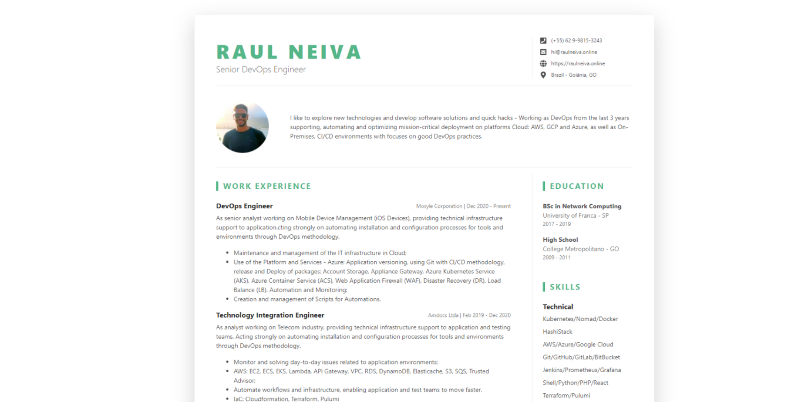

# raulneiva.online
> My DevResume page - https://raulneiva.online



## Dependencies

* [Nginx](https://www.nginx.com/)
* [Hugo](https://gohugo.io/getting-started/installing/)
* [Brew](https://brew.sh/)
* [Ruby](https://www.ruby-lang.org/pt/documentation/installation/)

## How to Install

```
# ruby
sudo apt install -y ruby-full

# brewinstall
/bin/bash -c "$(curl -fsSL https://raw.githubusercontent.com/Homebrew/install/HEAD/install.sh)"

# hugo
brew install hugo
```

## Run

```
$ hugo server -D

$ hugo (Create public folder and commit all changes)
```